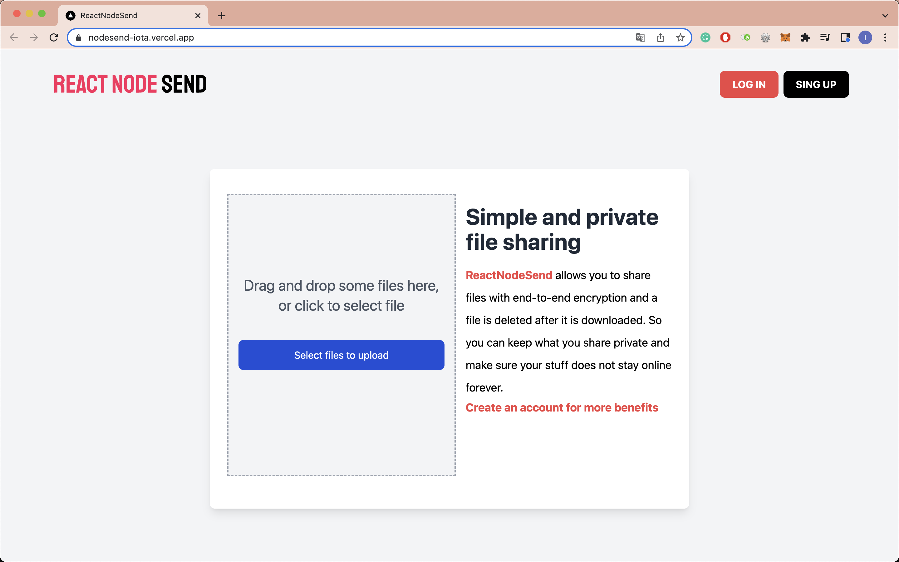

# ReactNodeSend

Website similar to Firebox Send using the MERN stack. This project belongs to the [React - La Guía Completa: Hooks Context Redux MERN +15 Apps](https://www.udemy.com/course/react-de-principiante-a-experto-creando-mas-de-10-aplicaciones/) course.

## :pushpin: Table of contents

- [Introduction](#rocket-introduction)
- [Usage](#wrench-usage)
  - [Environment variables](#pagefacingup-environment-variables)
- [Built with](#hammer-built-with)
  - [Frontend](#computer-frontend)
  - [Backend](#gear-backend)
  - [Deploy](#package-deployment)
- [Links](#link-links)
- [Author](#woman-author)

## :rocket: Introduction

The aim of this application is to share files easily and privately with your friends. 



- If you are not logged in, you can upload files up to 1MB. It will generate a link for you, which you share so they can download the file. Once downloaded, the file will be deleted from the server.

- If you are logged in, you can upload files larger than 1MB. You can also protect the download by attaching a password and you can decide after how many downloads the file will be deleted from the server.


## :wrench: Usage

To deploy the project locally, follow these steps:

1. Clone my repository with the command `git clone https://github.com/Inmacc96/nodesend.git`.
2. Access the backend folder from a terminal and run the following commands:

- `npm install`
- `npm start`

3. Next, access the frontend folder from another terminal and run the following commands:

- `yarn install`
- `yarn run dev`

Finally, you will have the server at http://localhost:4000 and the client at http://locahost:3000.

### :page_facing_up: Environment variables

It is important to add the _.env_ file in the backend folder with the following content:

```
MONGO_URI = XXXX

JWT_SECRET = XXXX

FRONTEND_URL = http://localhost:3000
```

where

- `MONGO_URI` is the URI of your MongoDB database,
- `JWT_SECRET` is the key to generate and decrypt your JWT.

In addition, you should add the _.env.local_ file in the frontend folder with the following:

```
NEXT_PUBLIC_backendURL =  http://localhost:4000
NEXT_PUBLIC_frontendURL = http://localhost:3000
```

If in doubt, please consult the administrator.

## :hammer: Built with

### :computer: Frontend

- [next JS](https://nextjs.org/): React framework used.
- [axios](https://axios-http.com/): To make HTTP requests to the server.
- [tailwindcss](https://tailwindcss.com/): CSS framework used.
- [formik](https://formik.org/): Library for working with forms in React
- [yup](https://www.npmjs.com/package/yup): To validate login and sign up forms.
- [react-dropzone](https://www.npmjs.com/package/react-dropzone): Used for file drag and drop handling.

### :gear: Backend

- [express](https://expressjs.com/): Node.js framework used.
- [mongoose](https://mongoosejs.com/): Used to perform the queries to the MongoDB database.
- [cors](https://www.npmjs.com/package/cors): To allow our client to access the server's resources.
- [dotenv](https://www.npmjs.com/package/dotenv): To access environment variables.
- [bcrypt](https://www.npmjs.com/package/bcrypt): Used to encrypt the user's password and to check that the password entered matches the original one.
- [jsonwebtoken](https://www.npmjs.com/package/jsonwebtoken): Used for user authentication.
- [express-validator](https://www.npmjs.com/package/express-validator): To validate the input data of the controllers.
- [multer](https://www.npmjs.com/package/multer): Used to upload files to the server.
- [shortid](https://www.npmjs.com/package/shortid): To generate non-sequential url-friendly unique ids.

### :package: Deployment

- Frontend: [Vercel](https://vercel.com/)
- Backend: [Render](https://render.com/)

## :link: Links

- Solution URL: [https://github.com/Inmacc96/nodesend](https://github.com/Inmacc96/nodesend)
- Live Site URL: [https://nodesend-iota.vercel.app/](https://nodesend-iota.vercel.app/)

## :woman: Author

- GitHub - [inmacc96](https://github.com/Inmacc96)
- LinkedIn - [Inma Caballero Carrero](https://www.linkedin.com/in/inmacaballerocarrero/)
